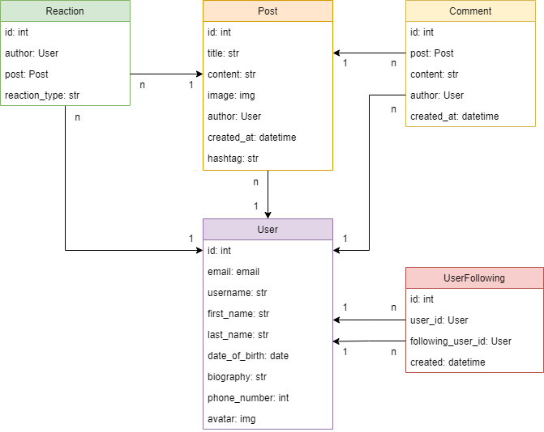
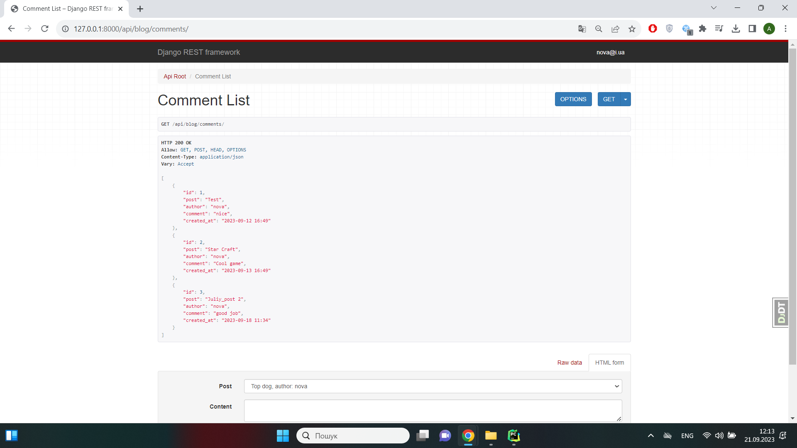
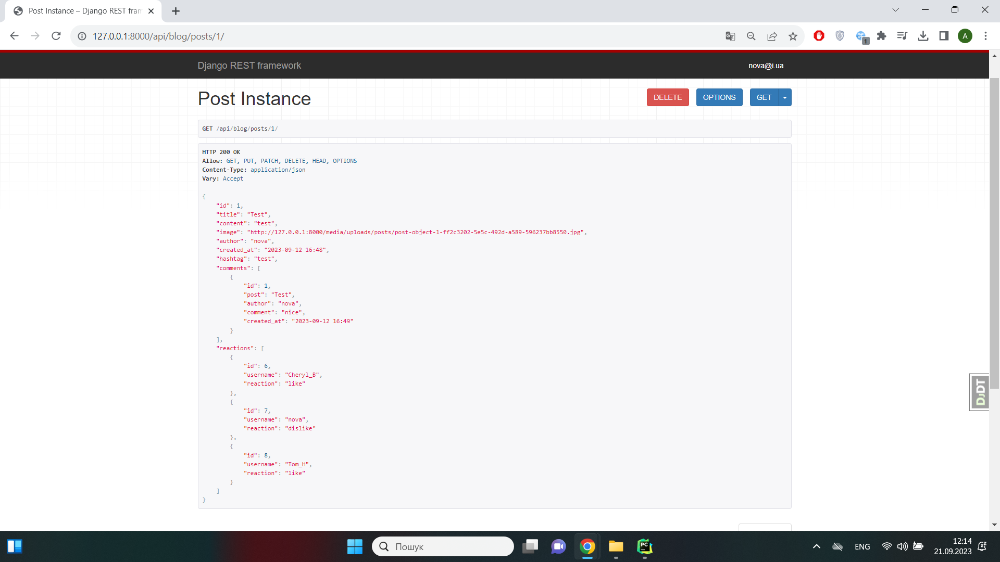
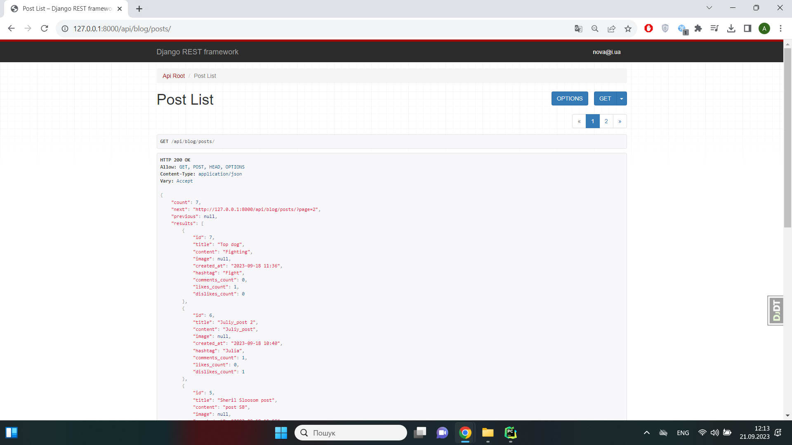
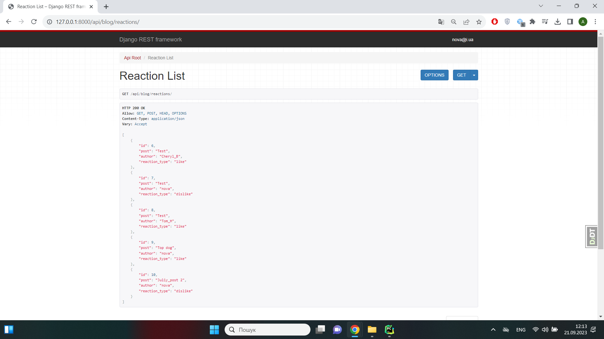
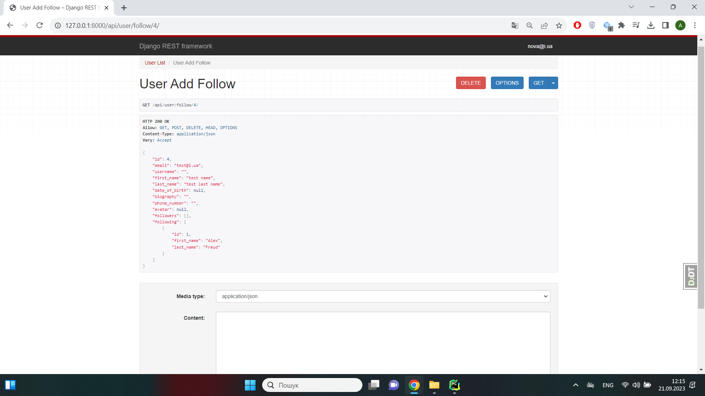
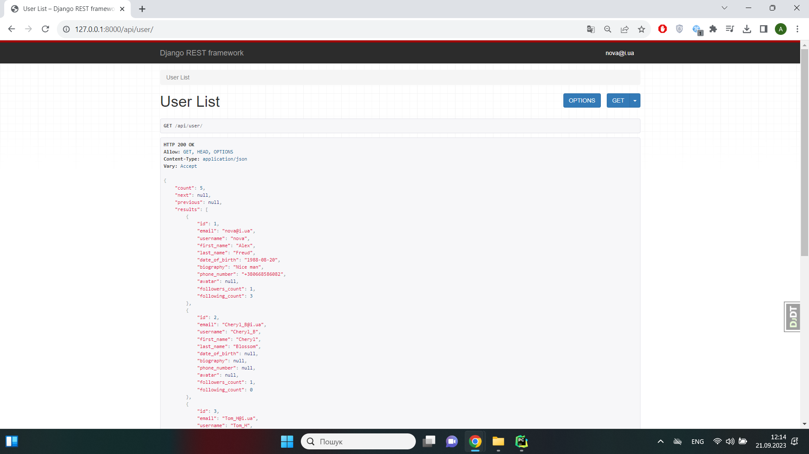
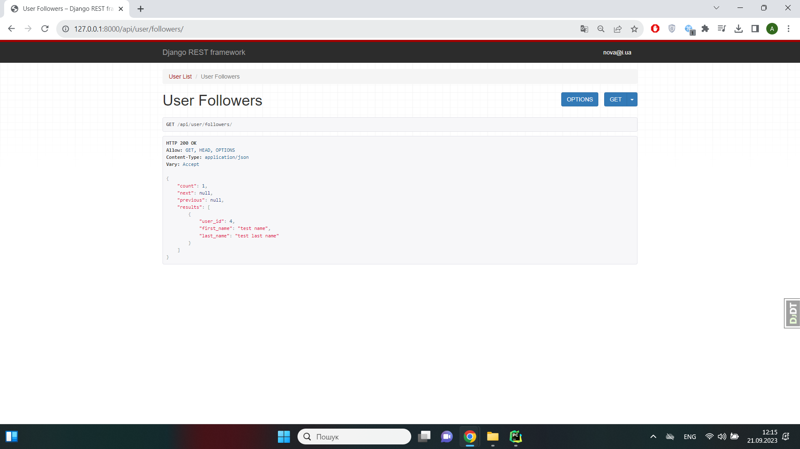
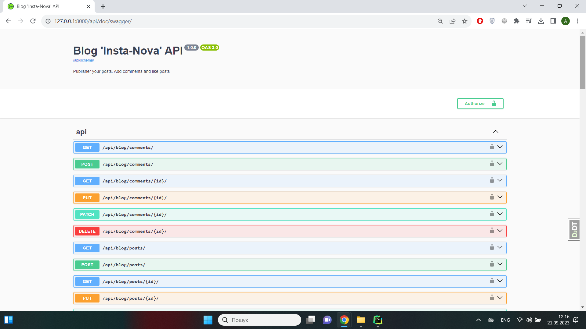
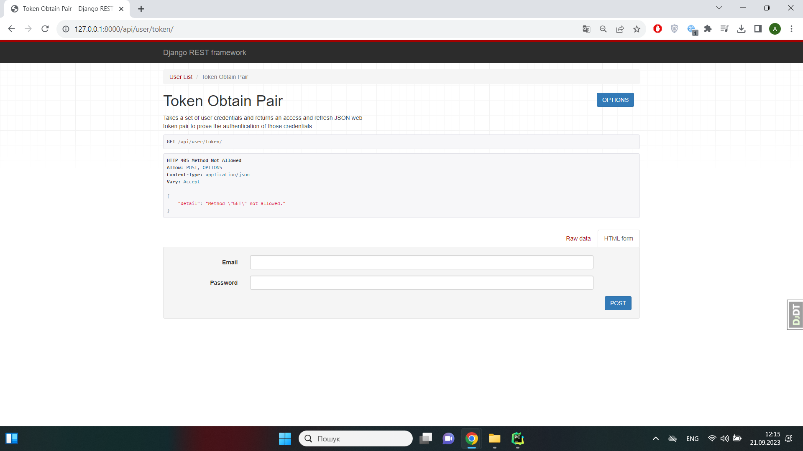

# Blog "Insta-Nova" API

The Social App Management API is a Django-based web interface.
an application designed to create your profile. View and subscribe to other profiles. Publishing posts, creating comments on them and liking posts. Anonymous users can only view this API. Provides
administrators and authenticated users with different
endpoints for interacting with the system. It includes features
such as viewing and filtering, managing profile, posts,
and more.

## Getting Started

### Prerequisites

Before you begin, make sure you have the following tools 
and technologies installed:

- Python (>=3.11)
- Django
- Django REST framework

## Installing:

### - Using Git

1. Clone the repo:

```
git clone https://github.com/Niki-Alex/insta-nova
```

2. You can open project in IDE and configure .env file using 
[.env.sample](./.env.sample) file as an example.

<details>
  <summary>Parameters for .env file:</summary>
  
  - DJANGO_SECRET_KEY: ```Your django secret key, you can 
generate one on https://djecrety.ir```
</details>

> To access browsable api, use http://localhost:8000/api/blog/
>
> To get access to the content, visit http://localhost:8000/api/user/token/ to get JWT token.
>
> Use the following admin user:
> - Email: test@i.ua
> - Password: blackstar1989

## API Endpoints

<details>
  <summary>User</summary>

- Information about all Users: ```GET /api/user/```
- Information about detail User: ```GET /api/user/{user_id}/```
- Information about current User following: ```GET /api/user/following/```
- Information about current User followers: ```GET /api/user/followers/```
- Follow for User: ```POST /api/user/follow/{user_id}/```
- Update current User: ```PUT /api/user/update/```
- Partial Update: ```PATCH /api/user/update/```
- Create new User: ```POST /api/user/register/```
- Create access and refresh tokens: ```POST /api/user/token/```
- Refresh access token: ```POST /api/user/token/refresh/```
- Verify tokens: ```POST /api/user/token/verify/```
- Logout (add token to blacklist): ```POST /api/user/logout/```
</details>

<details>
  <summary>Posts</summary>

- List Posts: ```GET /api/blog/posts/```
- Create Post: ```POST /api/blog/posts/```
- Retrieve Post: ```GET /api/blog/posts/{post_id}/```
- Update Post: ```PUT /api/blog/posts/{post_id}/```
- Partial Update ```PATCH /api/blog/posts/{post_id}/```
- Delete Post: ```DELETE /api/blog/posts/{post_id}/```
</details>

<details>
  <summary>User and User following Posts</summary>

- List Posts: ```GET /api/blog/user_posts/```
- Create Post: ```POST /api/blog/user_posts/```
- Retrieve Post: ```GET /api/blog/user_posts/{user_post_id}/```
- Update Post: ```PUT /api/blog/user_posts/{user_post_id}/```
- Partial Update ```PATCH /api/blog/user_posts/{user_post_id}/```
- Delete Post: ```DELETE /api/blog/user_posts/{user_post_id}/```
</details>

<details>
  <summary>Comments</summary>

- List Comments: ```GET /api/blog/comments/```
- Create Comment: ```POST /api/blog/comments/```
- Retrieve Comment: ```GET /api/blog/comments/{comment_id}/```
- Update Comment: ```PUT /api/blog/comments/{comment_id}/```
- Delete Comment: ```DELETE /api/blog/comments/{comment_id}/```
</details>

<details>
  <summary>Reactions</summary>

- List Reactions: ```GET /api/blog/reactions/```
- Create Reaction: ```POST /api/blog/reactions/```
- Retrieve Reaction: ```GET /api/blog/reactions/{reaction_id}/```
- Delete Reaction: ```DELETE /api/blog/reactions/{reaction_id}/```
</details>

## Authentication

- The API uses token-based authentication for user access.
Users need to obtain an authentication token when logging in.
- Authenticated users and anonymous users can
access to all endpoints, but can only be changed by an authenticated user
information exclusively about your posts, comments, etc. d.

## Documentation

- The API is documented using the OpenAPI standard.
- Access the API documentation by running the server and 
navigating to http://localhost:8000/api/doc/swagger/
- 
## DB Structure



## Endpoints













